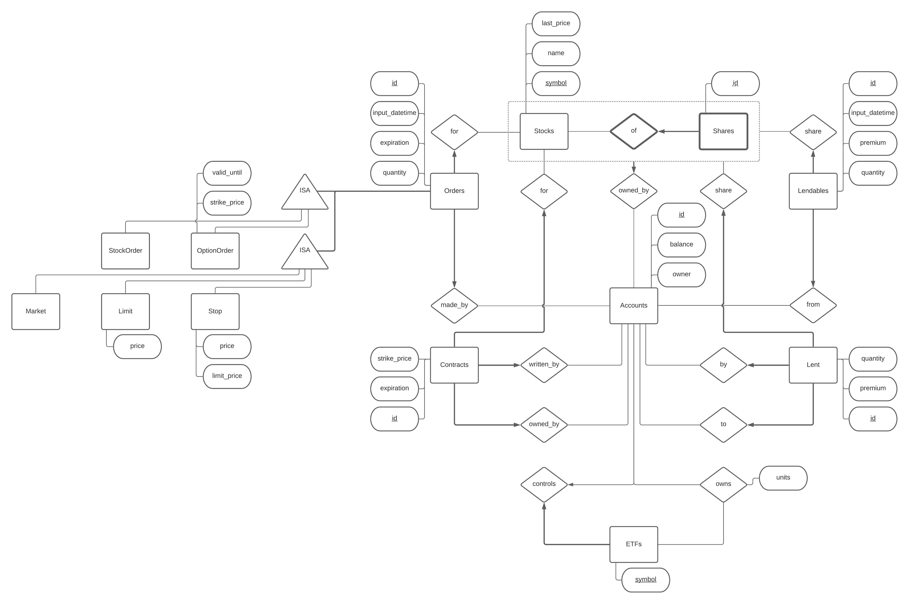

# UBC SX: The UBC Stock Exchange

Note: Some of the following is outdated.

The purpose of this project is to model a stock exchange in a way which ensures that all securities are accounted for. 
We will be implementing stocks and American-style options which can be held by accounts and traded by putting in 
market, limit, and stop orders. We also allow for the lending of shares though the lending system is simplified 
compared to the purchasing system. There is also a simplification of ETFs.

In this simplification, buying into an ETF deposits money into the account linked with the ETF and entitles you to 
units of the ETF depending on the percentage of the new total market value which you put in and the current total 
number of units. When you sell, you will be entitled to your share of the market value based on how many units you are 
selling and how many total units exist. If there is not enough balance, shares will be automatically sold at market 
price depending on their default sort order.

There are some limitations to this model. In this model, everyone directly controls accounts with the exchanges, there 
are no brokers, clearinghouses, or market-makers. All shares are controlled by the exchange rather than only being 
traded by the exchange. I consider this a benefit because it means that fake shares, naked shorts, and failure to 
deliver are less likely or impossible to happen.

Our application will run using Python and MySQL, likely as a web application. Our application will allow users to 
create an account which has a starting balance. Users with accounts can IPO companies, enter buy and sell orders for 
shares and options, borrow or lend out shares, and create an ETF associated with their account. One user may have 
multiple accounts. We have not yet decided on how users will be authenticated (we may not do authentication for 
demonstration purposes).



Note that Orders has two ISA relationships. Formally: StockOrder AND OptionOrder COVER Orders. Market AND Limit AND 
Stop COVER Order. To be clear, an order must be exactly two things, one of StockOrder or OptionOrder (but not both) and 
it must also be one of Market, Limit, or Stop. This means that an order could be both a StockOrder and Market but it 
could not be Market and Limit or SockOrder and OptionOrder and Stop. In the diagram, I modelled this by using two 
independent ISA relationships which each have total participation by the Orders entity.

## Testing

In order to test the website you will need to install it on your user account for the server. The easiest way to do this
is to use some JetBrains IDE and use deployment, but you could also directly clone this repo in `~/public_html`. Other
IDEs likely also have ways to achieve similar results. The following are the steps that I used in PyCharm which should
be similar in other JetBrains IDEs (I'll probably also use WebStorm).

* Clone this repository on your computer and open it with PyCharm or another JetBrains IDE.
* Open `schema.ddl` and copy the contents.
* Log into one of the CS servers.
* Type `mkdir -p ~/public_html/304` and press enter.
* Type `mysql -h dbserver.students.cs.ubc.ca -u $USER -p $USER` and press enter. You will be prompted for a password.
  Type in `a{Student ID}` where `{Student ID}` is your UBC student ID and press enter.
* You should now have a MySQL command prompt.
* Type `DROP DATABASE {CWL};` where `{CWL}` is your UBC CWL. Remember the semicolon at the end. Press enter.
* Then type `CREATE DATABASE {CWL};` and press enter. This just ensures that your database is reset to the default.
* Then type `USE {CWL};` and press enter to select that we want to work within our newly empty database.
* If you copied some previous commands then you may need to go back and copy the DDL again. Now you can paste in
  that DDL, you should not see any errors.
* Type `exit` and press enter to leave. You may now log off the server.
* Now go back to PyCharm and click the Tools menu.
* Under the deployment sub-menu, click Configuration.
* Click the plus button and click SFTP. Enter a name such as "UBC CS Server" and click ok.
* If you click the dropdown next to SSH Configuration, you may already have one of the UBC servers set up such as if you
  had configured a database connection. If not, follow the next steps.
    * Click the three dots next to that dropdown.
    * Click the plus button.
    * Enter `annacis.students.cs.ubc.ca` as the server (I use this one since there is low usage, and we don't need extra
      speed from the higher powered servers).
    * Enter 22 as the port (it does not always default to this for some reason).
    * Enter your CWL as the username.
    * If you are on macOS or Linux and have transferred your SSH key to the server then you can select OpenSSH as the
      authentication option. Otherwise, you can manually configure an SSH key, but the easiest is to choose password.
      It's the same password for logging into the server since that is what we are doing. I would select to save the
      password.
    * Click Test Connection to make sure that it works.
* Under Root Path, enter `/users/{L}/{CWL}/public_html/304` where `{CWL}` is your UBC CWL and `{L}` is the first
  letter of your CWL.
* Under URL, enter `https://www.students.cs.ubc.ca/~{CWL}/304/`.
* Go to the Mappings tab.
* Under Local Path, go to the end of the line and add `/304`.
* Press ok.
* Click on the Tools menu again.
* Under the deployment sub-menu, click Automatic Upload.
* Click on the Tools menu one more time.
* Under the deployment sub-menu, click Options.
* Ensure that the checkboxes for Override permissions on files and Override permissions on folders are checked.
* Click the folder icon next to the text field for Override permissions on files.
* Enter 755 and press ok (this ensures that the server can execute our scripts). Press ok on the options window.
* Under the Project tab which shows you the files in this project, right-click on 304.
* Under the Deployment sub-menu, click upload to UBC CS Server.
* Try visiting `https://www.students.cs.ubc.ca/~{CWL}/304/test.py` to see if it works. Visiting will open a pop-up box
  where you must enter your CWL username and password. This is normal and what will allow the server to authenticate
  users based on their CWL.
  
If everything worked, visiting that URL should show you a response similar to the following (all values have been
altered to be realistic but not my actual values):
```
Hello, World!

Welcome! Your CWL username is: yourcwl

Here are the environment variables which are avalible in this script:
    PATH: /usr/local/bin:/usr/bin:/bin
    HTTPS: on
    SSL_TLS_SNI: www.students.cs.ubc.ca
    HTTP_HOST: www.students.cs.ubc.ca
    HTTP_SEC_CH_UA: " Not;A Brand";v="99", "Google Chrome";v="91", "Chromium";v="91"
    HTTP_SEC_CH_UA_MOBILE: ?0
    HTTP_UPGRADE_INSECURE_REQUESTS: 1
    HTTP_USER_AGENT: Mozilla/5.0 (Macintosh; Intel Mac OS X 10_15_7) AppleWebKit/537.36 (KHTML, like Gecko) Chrome/91.0.4449.2 Safari/537.36
    HTTP_ACCEPT: text/html,application/xhtml+xml,application/xml;q=0.9,image/avif,image/webp,image/apng,*/*;q=0.8,application/signed-exchange;v=b3;q=0.9
    HTTP_SEC_FETCH_SITE: none
    HTTP_SEC_FETCH_MODE: navigate
    HTTP_SEC_FETCH_USER: ?1
    HTTP_SEC_FETCH_DEST: document
    HTTP_ACCEPT_ENCODING: gzip, deflate, br
    HTTP_ACCEPT_LANGUAGE: en-CA,en-GB;q=0.9,en-US;q=0.8,en;q=0.7,en-AU;q=0.6,en-NZ;q=0.5,en-ZA;q=0.4
    HTTP_COOKIE: ExpirePage=https://mycareers.adm.ubc.ca/psc/erecruit/; PS_LOGINLIST=https://mycareers.adm.ubc.ca/erecruit; SignOnDefault=; PS_TOKENEXPIRE=8_Sep_2019_20:27:15_GMT; PS_DEVICEFEATURES=width:1680 height:1050 pixelratio:2 touch:0 geolocation:1 websockets:1 webworkers:1 datepicker:1 dtpicker:1 timepicker:1 dnd:1 sessionstorage:1 localstorage:1 history:1 canvas:1 svg:1 postmessage:1 hc:0; PHPSESSID=a6s3igiog8gqv4risbsjgsb5tk
    HTTP_X_ORIGINAL_PROTOCOL: https
    HTTP_X_ORIGINAL_ADDRESS: www.students.cs.ubc.ca:443
    HTTP_X_FORWARDED_HOST: www.students.cs.ubc.ca
    HTTP_X_FORWARDED_SERVER: www.students.cs.ubc.ca
    HTTP_CONNECTION: close
    SERVER_SIGNATURE: <address>Apache/2.4.43 (Linux/SUSE) Server at www.students.cs.ubc.ca Port 443</address>

    SERVER_SOFTWARE: Apache/2.4.43 (Linux/SUSE)
    SERVER_NAME: www.students.cs.ubc.ca
    SERVER_ADDR: 198.162.33.106
    SERVER_PORT: 443
    REMOTE_ADDR: 11.71.192.254
    DOCUMENT_ROOT: /srv/www/htdocs
    REQUEST_SCHEME: https
    CONTEXT_PREFIX: /~yourcwl
    CONTEXT_DOCUMENT_ROOT: /home/y/yourcwl/public_html
    SERVER_ADMIN: help@cs.ubc.ca
    SCRIPT_FILENAME: /home/y/yourcwl/public_html/304/test.py
    REMOTE_PORT: 40090
    REMOTE_USER: yourcwl
    AUTH_TYPE: Basic
    GATEWAY_INTERFACE: CGI/1.1
    SERVER_PROTOCOL: HTTP/1.1
    REQUEST_METHOD: GET
    QUERY_STRING: 
    REQUEST_URI: /~yourcwl/304/test.py
    SCRIPT_NAME: /~yourcwl/304/test.py
    LC_CTYPE: C.UTF-8
```
